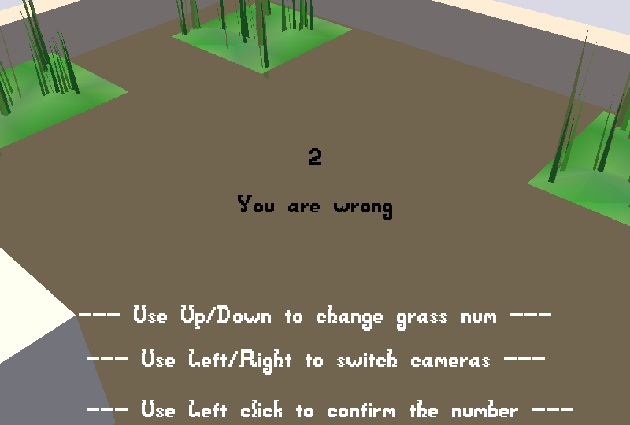

Find grass in the room

Author: Xuyang Fang

Design: Search the room and find how many grasses are there in the room.

Screen Shot:

How To Play:

Use left/right to switch camera, use up/down to change number of grasses, use left click to confirm the number.

Sources:

all sources come from city.blend in the game3 base code repository

This game was built with [NEST](NEST.md).
